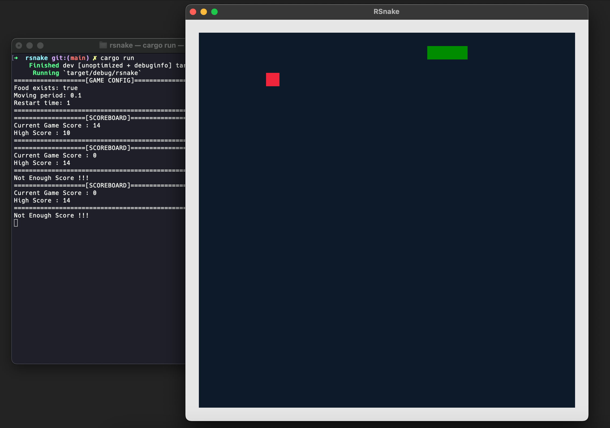

# RSnake

Snake game made in rust lang using `piston_window` game engine.



## File Structure

```sh
---- /src
|    - draw.rs
|    - game.rs
|    - snake.rs
|    - main.rs
---- /target
---- Cargo.toml
---- config.json
---- score.txt
---- Readme.md
```

- `draw.rs` : This file contains all the functions that allow to create the block and rectangle using the piston_window library.
- `game.rs` : This file contains all the functions that are related to Game and it also contains the functions to check the snake state.
- `snake.rs` : This file contains all the functions related to updating the state of the snake and checking the current state.
- `main.rs` : This file contains all the main functions to init the game and make the canvas to render a window.
- `config.json` : This file contains the config for the game.
- `score.txt` : This file tracks the score.

**CONFIG file :**

```json
{
  "food_exists": "true",
  "moving_period": "0.1",
  "restart_time": "1.0"
}
```

1. food_exists : Initiate food in game or not.
2. moving_period : Game speed.
3. restart_time : Time after that game will restart after the `game_over`.

## Build

```sh
cargo update
cargo build
```

## Run

```sh
cargo run
```

## Libraries

Piston Window

- <https://docs.rs/piston_window/latest/piston_window/>

Rand

- <https://docs.rs/rand/0.8.5/rand/>
